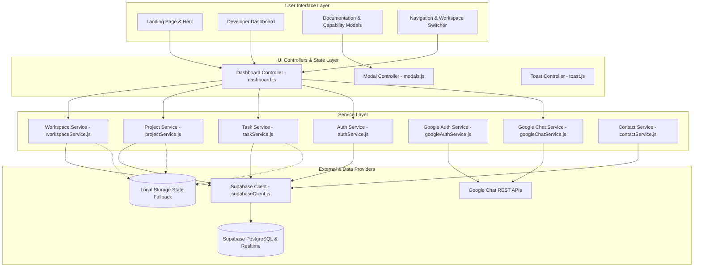
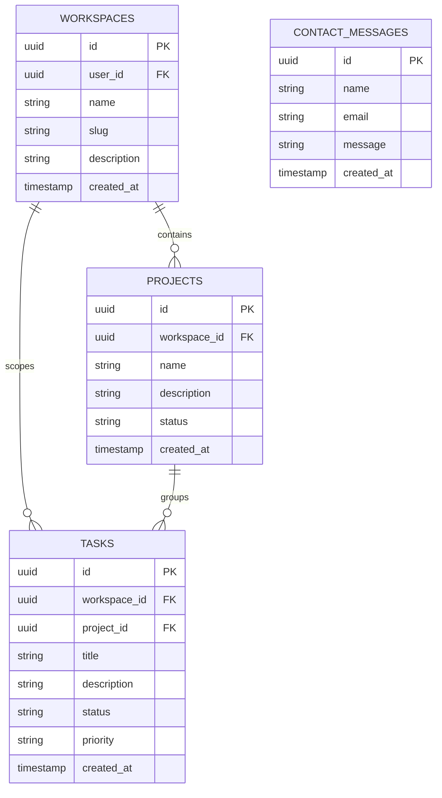

# DevFlow

> A unified developer productivity workspace combining engineering project registries, real-time task pipelines, sprint telemetry, technical architecture documentation, and Google Workspace team collaboration.

DevFlow bridges the gap between high-level architectural planning and day-to-day sprint execution. It provides engineering teams with an integrated dashboard to manage multi-workspace project lifecycles, monitor sprint health, inspect cloud capabilities, and broadcast milestone updates directly to team communication channels.

---

## Table of Contents

- [Project Overview](#project-overview)
- [Key Features](#key-features)
  - [Responsive Landing Page](#responsive-landing-page)
  - [Developer Workspace Dashboard](#developer-workspace-dashboard)
  - [Productivity Metrics & Telemetry](#productivity-metrics--telemetry)
  - [Interactive Task Pipeline](#interactive-task-pipeline)
  - [Supabase Backend & Authentication](#supabase-backend--authentication)
  - [Technical Documentation System](#technical-documentation-system)
  - [Deep Capability Inspection](#deep-capability-inspection)
  - [Google Workspace & Google Chat](#google-workspace--google-chat)
- [Tech Stack](#tech-stack)
- [System Architecture](#system-architecture)
  - [Architecture Diagram](#architecture-diagram)
  - [Core Services](#core-services)
- [Database Architecture](#database-architecture)
- [Authentication & Security](#authentication--security)
- [Environment Variables](#environment-variables)
- [Getting Started](#getting-started)
  - [Prerequisites](#prerequisites)
  - [Installation](#installation)
  - [Available Scripts](#available-scripts)
- [License](#license)

---

## Project Overview

Modern software development often suffers from tool fragmentation—teams jump between issue trackers, telemetry dashboards, technical documentation portals, and messaging tools. 

**DevFlow** provides a consolidated platform tailored for development teams, technical leads, and open-source maintainers:
- **Unified Workspace**: An interactive environment connecting project registries, real-time sprint pipelines, and documentation.
- **Immediate Exploration**: An interactive landing page featuring a live architectural switchboard, feature deep dives, and instant transition to the interactive live demo workspace without friction.
- **Dual-Mode Persistence**: Full cloud synchronization via Supabase PostgreSQL and Realtime subscriptions, backed by a resilient local offline state engine for preview and demo environments.

---

## Key Features

### Responsive Landing Page
- **Hero Showcase**: High-impact, two-column layout highlighting developer ergonomics with an interactive visual architectural switchboard.
- **Feature Exploration**: Categorized feature cards covering zero-config setup, telemetry analytics, and team collaboration.
- **Three-Phase Workflow**: Visual roadmap outlining the architectural journey from blueprint design to continuous deployment.
- **Adaptive Responsive Design**: Native fluid scaling across mobile devices (390px), tablets (768px), and ultra-wide desktop monitors (1920px).

### Developer Workspace Dashboard
- **Multi-Tab Navigation**: Seamless switching between Overview/Pipeline, Projects Registry, Team Tasks Board, and Google Chat spaces.
- **Active Workspace Switcher**: Manage and switch across multiple engineering workspaces with instant state updates.
- **Dynamic Project Registry**: Create, track, and monitor active engineering projects with automated task progress rollups.

### Productivity Metrics & Telemetry
- **Active Projects Count**: Real-time counter of ongoing initiatives within the selected workspace.
- **Open vs. Completed Tasks**: Live ratio of pending tasks to delivered milestones.
- **Overall Sprint Progress**: Dynamically computed completion percentage with visual progress indicators.

### Interactive Task Pipeline
- **Tri-State Task Workflow**: Status management across `Todo`, `In Progress`, and `Completed`.
- **Live Status Toggling**: Instant completion toggles that recalculate workspace metrics in real time.
- **Multi-Criteria Filtering & Search**: Instant client-side filtering by status pills and keyword query matching.

### Supabase Backend & Authentication
- **Secure User Authentication**: Email and password sign-up, sign-in, and sign-out with local session persistence.
- **Postgres Entity Management**: Relational data models for workspaces, projects, tasks, and contact submissions.
- **Realtime Channel Subscriptions**: Automatic live updates on task changes and project state.
- **Offline & Demo Fallback**: Local storage fallback ensuring a functional application even in isolated offline environments.

### Technical Documentation System
- **Structured Categories**: Browse guides across *Getting Started*, *Architecture*, *Cloud Edge*, *CLI & SDK*, and *Troubleshooting*.
- **Instant Search**: Real-time keyword filter across guides and implementation articles.
- **Developer Snippets**: Syntax-highlighted, one-click copyable code examples.

### Deep Capability Inspection
- **Interactive Modals**: Detailed architectural breakdowns of DevFlow capabilities.
- **Benchmark & Telemetry Specs**: Live metrics, throughput stats, and architectural benefits.
- **Direct Workspace CTA**: One-click transition from documentation into the active live demo.

### Google Workspace & Google Chat
- **Google Identity Services (GSI)**: Client-side OAuth 2.0 flow supporting Google Workspace scopes.
- **Chat Spaces & Message Streams**: View accessible spaces, inspect channel members, and render recent message history.
- **Sprint & Milestone Broadcasts**: Publish markdown-formatted sprint announcements and task milestone notifications directly into active team chat channels.

---

## Tech Stack

| Technology | Purpose |
|------------|---------|
| **HTML5** | Semantic structure, accessibility landmarks, and accessible dialogs |
| **CSS3 & Tailwind CSS** | Responsive styling, typography hierarchy, and UI animations |
| **JavaScript (ES Modules)** | Modular application logic, state managers, and controllers |
| **TypeScript** | Type checking and compilation validation |
| **Vite** | Development server and production bundling |
| **Supabase (`@supabase/supabase-js`)** | User authentication, PostgreSQL database, and real-time subscriptions |
| **Google Identity Services (GSI)** | Client-side OAuth 2.0 token acquisition for Workspace integrations |
| **Google Chat REST API** | Spaces listing, member retrieval, and team messaging |
| **Lucide Icons** | Visual iconography |

---

## System Architecture

### Architecture Diagram



### Core Services

- **`supabaseClient.js`**: Initializes the public Supabase client using client-safe environment keys with connection status detection.
- **`authService.js`**: Handles user registration, credentials sign-in, session recovery, and user profile state.
- **`workspaceService.js`**: Manages workspace creation, listing, switching, and local fallback replication.
- **`projectService.js`**: Manages project lifecycle linked to active workspaces with calculated task completion metrics.
- **`taskService.js`**: Manages task CRUD operations, real-time status toggling, filtering, and live event emissions.
- **`googleAuthService.js`**: Manages client-side Google OAuth 2.0 token acquisition and expiration lifecycle.
- **`googleChatService.js`**: Fetches Google Chat spaces, stream messages, and posts sprint announcements.
- **`contactService.js`**: Handles contact inquiry validation, submissions, and toast feedback.

---

## Database Architecture

DevFlow models data within a relational Supabase PostgreSQL schema structured around user workspaces:



---

## Authentication & Security

DevFlow enforces strict security practices across all client and backend operations:

- **Client-Safe Keys Only**: Only the public Supabase URL and anonymous publishable key (`VITE_SUPABASE_ANON_KEY`) are utilized in browser code.
- **Zero Exposed Secrets**: The Supabase `service_role` key, database passwords, and private OAuth secrets are never used or committed.
- **Client-Side OAuth Tokens**: Google Workspace access tokens are acquired via client-side popup/redirect flows (GSI) and held in ephemeral memory/session storage only.
- **Row Level Security (RLS)**: Database policies restrict data mutation to authenticated users scoped by workspace ownership.

> **Security Rule for Contributors**:
> Never commit `.env` files, private API keys, Supabase service-role keys, database passwords, or OAuth client secrets to the Git repository.

---

## Environment Variables

DevFlow uses environment variables defined in `.env.example` for optional cloud synchronization:

```env
# Supabase Configuration
VITE_SUPABASE_URL=https://your-project.supabase.co
VITE_SUPABASE_ANON_KEY=your-supabase-anon-key

# Fallback names for compatibility
SUPABASE_URL=https://your-project.supabase.co
SUPABASE_ANON_KEY=your-supabase-anon-key
```

*Note: If Supabase credentials are omitted, DevFlow runs in resilient offline/demo mode using local persistence.*

---

## Getting Started

### Prerequisites
- **Node.js**: v18.0.0 or higher
- **npm**: v9.0.0 or higher

### Installation

1. **Clone the repository**:
   ```bash
   git clone https://github.com/your-username/devflow.git
   cd devflow
   ```

2. **Install dependencies**:
   ```bash
   npm install
   ```

3. **Configure environment variables (Optional)**:
   ```bash
   cp .env.example .env
   # Populate VITE_SUPABASE_URL and VITE_SUPABASE_ANON_KEY if connecting to Supabase
   ```

4. **Start the local development server**:
   ```bash
   npm run dev
   ```
   Open [http://localhost:3000](http://localhost:3000) in your browser.

### Available Scripts

| Command | Description |
|---------|-------------|
| `npm run dev` | Starts the Vite development server on port 3000 |
| `npm run build` | Compiles the production build into the `dist/` directory |
| `npm run preview` | Previews the generated production build locally |
| `npm run lint` | Runs TypeScript compiler checks (`tsc --noEmit`) |
| `npm run clean` | Removes build artifacts and cached output files |

---

## License

This project is licensed under the MIT License.
